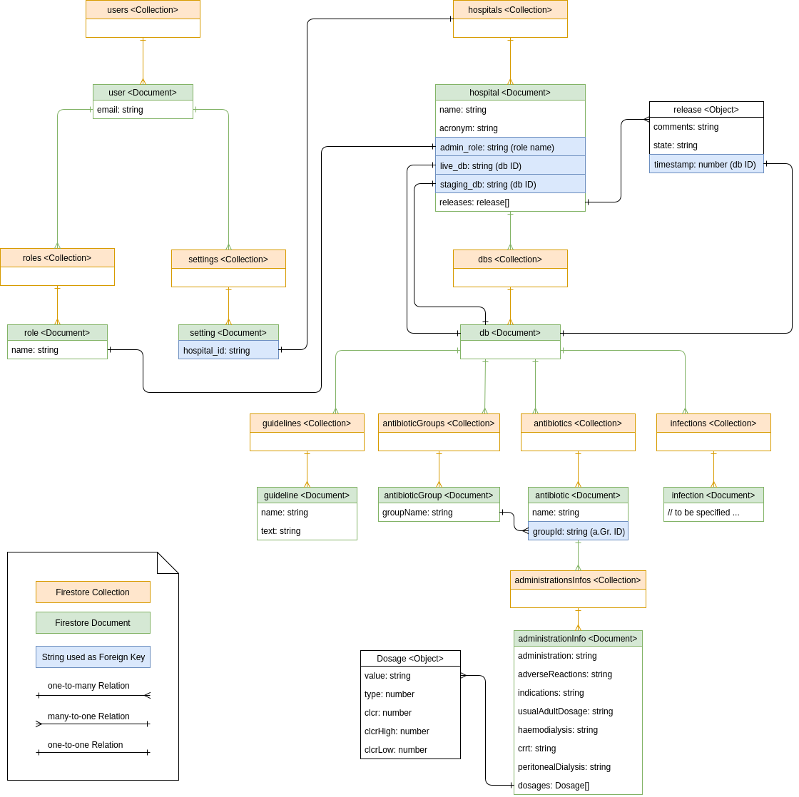

# Description
This is the repository for **Mobile App for Antimicrobial Dispensatory** that is 
developed together with *Singapore General Hospital* and *Changi General Hospital*.

# Documentation
The project documentation is included in the documentation folder of this repo.
 - [Requirements](documentation/requirements.md)
 - [Design](documentation/design.md)
 - [Data Migration](documentation/migration.md)

# Setup Development Environment
Because there are many different Node and NPM versions, it's best to use something like
[nvm](https://github.com/creationix/nvm) to manage your installations.

If you would like to use nvm, follow these instructions: [nvm](https://github.com/creationix/nvm)

## Known-to-work configuration
1. We used `nodejs v8.4.0` and `npm 5.3.0` because newer versions caused some problems with our 
 installation of `ionic 3.19.1`.
2. Install ionic 3.19.1 with: 
```
$ npm install -g ionic@3.19.1
```
## Use up-to-date versions
Instead of using the versions we used you can also try to use the latest versions (this could break some things).

For installation of the latest version of ionic visit the [Getting Started Page](https://ionicframework.com/getting-started/).

# Getting Started
In order to familiarize yourself with ionic and the workflow of this project, you can
start with the following tutorials.

## Apply and Download WebStorm
  	1. Register account [here](https://www.jetbrains.com/shop/eform/students)
  	2. You will recevie a complete account registration email with a confimation link
  	3. Follow the instructions
## Tutorials
    1. Angular Tutorial: https://angular.io/tutorial
  	2. Ionic Tutorial: https://ionicframework.com/docs/intro/tutorial/
  	3. Git Tutorial: https://try.github.io/levels/1/challenges/1
  	
## Project Setup
- After cloning this project to a local folder, run `npm install` from a terminal inside the project folder to install all dependencies for the project *Note: Tested with Node.js v8.4.0 and npm v5.5.1*
- To start the App in your browser, you can run `ionic serve` or `ionic serve --lab`
- Request access to Firebase and SIT GitLab from Mr Law Chee Yong (LawCheeYong@gmail.com)

## Code Style
If you're using WebStorm or any other JetBrains IDE, I would strongly recommend you to import the 
Code-Styles from `TypeScript-CodeStyles.xml` into your IDE.

In order to do that, got to **File**->**Settings**->**Editor**->**Code Style**->**TypeScript** and click on the small gear icon to select *import...*, then select the File `TypeScript-CodeStyles.xml` from the project folder. 


# Deployment
All parts of the App including backend code for cloud functions, rules for database-access and configurations are hosted on firebase. So deployment is a really simple process which only requires a single command: `firebase deploy`.

Before deploying a new version of the App, increase `version` in package.json and create a new release build with `npm run ionic:build -- --prod`.
 

- Make sure you have `firebase-tools` installed: `npm i -g @google-cloud/firebase-tools`
- Login to firebase: `firebase login` (A Browser Window should open)
- With `firebase deploy` you can deploy the whole App with all DB-Rules and cloud functions.
- To run the hosted application, run https://sgh-antibiotics.firebaseapp.com/ in your browser.

# Seeding the Database

We created some scripts to initially import some data from the old Android App to our new database.
 
**Warning:** Use them with care, because they can overwrite the whole production DB which is not reversible. 

Instructions on how to use them are in the folder [sgh-antibiotics-seeder](sgh-antibiotics-seeder/README.md).

# Database Diagram


# Workflow
We are using the [Git Feature Branch Workflow](https://www.atlassian.com/git/tutorials/comparing-workflows/feature-branch-workflow) at this project. Each new feature 
or Bug is tracked by the Gitlab Issue Tracker. If you want to work on an issue, please
create a new branch for it by branching off the develop branch. The name should be derived from the 
issue name and whitespache should be replaced with '-' (e.g. Issue No. 5 
*Add test data* would result in the branch name *5-Add-test-data*).
