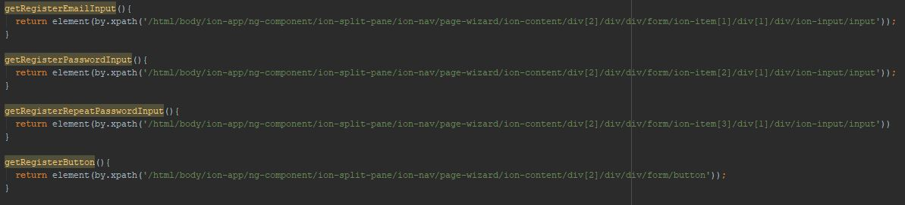

End to End Testing Guide
======
This is a documented guide on the files involving software testing in the project 

as well as how to operate the Protractor e2e test cases.

READ THROUGH THIS WHOLE DOCUMENTATION BEFORE TESTING THE APPLICATION TO AVOID ANY DAMAGE.

# Software Testing in an Ionic Application

Applications that are made with an `Ionic` framework essentially make use of `Angular`. 

`Protractor` acts as an end-to-end testing framework for both `Angular` and non-Angular applications 

that does not use CSS attributes to automatically test an HTML based application like a real user would.

# Installation

`Protractor` is already installed in this version of the project but [here](https://www.joshmorony.com/e2e-end-to-end-testing-in-ionic-2-an-introduction/) is a quick guide on how to install it in your application.

# Files concerning software testing

**1. protractor.conf.js:**

This is the configuration file for your `Protractor` and it houses information such as the file format that `Protractor` should look for when running test cases. 

In this case the file format is `*.e2e-spec.ts`.

**2. 'e2e' directory:**

There is a directory titled `e2e` in the root of this application. 

It houses all your `page objects` and `test case` files for software testing.

It contains:
1. 'page-objects' directory `(*.page-object.ts)`
2. e2e spec files `(*.e2e-spec.ts)`
4. `tsconfig.json`

**3. page-objects**

This directory contains files with the format of `*.page-object.ts`. 

These files contain methods that returns elements which we will use in our test cases to point protractor to the parts of the app that we want to interact with.

Example:

`wizard.page-object.ts`

The `getRegisterEmailInput(`) returns an `xpath` for an `ion-input` where the user can input their email for registration. 

We will use this method later on to point protractor to the right element of the app. 

Other than `xpath`, there are many [other ways](https://www.protractortest.org/#/api?view=ProtractorBy) to return an element.

**4. .e2e-spec.ts**

These files are what contains all of our test cases. 

`Protractor` will look for these files and run the test cases within them.

Example:

`setup.e2e-spec.ts`

We send an email string to the email ion-input from the previous example via sendKeys on line 42.

**5. tsconfig.json**

Another config file necessary for Protractor end to end testing.

# Correlation between page-object and e2e-spec files

The following `e2e-spec.ts` files get their return elements from the following `.page-object.ts` files:

`calculator.e2e-spec.ts` & `calculator.page-object.ts`

`settings.e2e-spec.ts` & `settings.page-object.ts`

`setup.e2e-spec.ts` & `wizard.page-object.ts`

`antibiotics.e2e-spec.ts` & `antimicrobials.page-object.ts`

`guidelines.e2e-spec.ts` & `guidelines.page-object.ts`

`user-management.e2e-spec.ts` & `user-management.page-object.ts`

`hospital-management.e2e-spec.ts` & `hospital-management.page-object.ts`

---

These correlations are not absolute and some `e2e-spec` files get return elements and methods from other `page-object` files.

#Test Cases

**1. `setup.e2e-spec.ts`**
===
Tests the `wizard` (the login) page of the application.

Functions:

-Login under CGH as Admin

-Login under SGH as Admin

-Login under CGH as User

-Login under SGH as User

-Register New User

**2. `calculator.e2e.spec.ts`**
===
This tests the `Calculator` page's functions of the app.

Functions:

-Calculate Cockroft-Gault Equation

-Calculate Ideal Body Weight

-Calculate Adjusted Body Weight

-Calculate Body Surface Area

-Calculate CRUB-65

**3. `setup.e2e.spec.ts`** 
===
This tests the `Settings` page. 

Functions:

-Change Hospital

-Change Database

-Change Password

-Change User

-Set Master Edit 

**4. `antimicrobials.e2e-spec.ts`**
===
Tests the `Antimicrobials` page.

Functions:

-Viewing Antibiotics

-Search Antibiotics

-Search Antibiotic Dosage

-Calculate Antibiotic Dosage

Add New Antibiotic Group

-Edit Antibiotic Group

-Delete Antibiotic Group

-Add New Antibiotic

-Edit Antibiotic Details

-Delete Antibiotic Details

**5. `guidelines.e2e-spec.ts`**
===
Tests the `Guidelines` page.

Functions:

-View Guidelines

-Add New Guideline

-Edit Guideline Name

-Edit Guideline Information

-Delete Guideline

**6. `user-management.e2e-spec.ts`**
===
Tests the `User Management` page.

Functions:

-Search User

-View User Details

-Grant Superadmin Rights

-Remove Superadmin Rights

-Grant Hospital Admin Rights

-Remove Hospital Admin Rights

**7. `hospital-management.e2e-spec.ts`**
===

Tests the `Hospital Management` page.

Functions: 

-Search Hospital

-View Hospital Details

-Add Hospital

-Edit Hospital Details

-Add New Database Release

**For the detailed functions click [here](https://docs.google.com/document/d/1abbm7Napa3aDNrirSPZoEnXDIOKELWtbDg7qToXYLFI/edit#).**

#Running Protractor

To run `Protractor`, make sure that the roles and details for the accounts:

`girolkyle3@gmail.com`, `superadmin@example.sg`, `secondadmin@example.sg` & `test@example.com`

are not changed.

*Also make sure that there is a testing hospital named `test-hospital`.

Ensure it has `2 database releases`, this hospital MUST be the first hospital on the list.

If it is not on top of the list then delete and create again. 

If `test-hospital` is missing then create one in the `Hospital Management` page as an admin.

Once done open up a terminal and change directories `(cd)` to the root of your project. 

Once done enter the command `'protractor'` to begin software testing your test cases. 

Protractor will open up your default browser to start testing your test cases. 

Protractor will run all available test cases so if you wish to skip any just comment them out.

You can see if the test cases failed or passed in the terminal.

Example in `calculator.e2e-spec.ts`:

The title 'Calculator Test Cases' is stated in the **describe** blocks of e2e-spec.ts files. The same goes for every other titles.

Green text with ticks affixed to them means that these test cases passed. Otherwise they will be red, meaning failure.

Errors in the test cases will also be displayed if they violate the **expect** statements.

Protractor Error
==

If you encounter an error concerning a line that follows:

The line of code still functions as intended and should NOT be removed. 

Do not import the Protractor package when you are prompted to do so.

Error in terminal when running `'protractor'`
==

When running protractor in the terminal you may encounter an unwanted failure in the test cases. 

This may be due to Protractor not being able to find the elements in the DOM at the point of time the code is executed.

If the problem is encountered you are suggested to try and run `'protractor'` one more time.

The highest chances of this occurring is during first startup of the project 

and first execution of the command `'protractor'`.

Aftermath of running `'protractor'`
==

After running the test cases there will be unwanted data in the database. 

Make sure to delete the following:

-Any unwanted hospitals under the `Database` in the `Firebase` console.

-Any unwanted accounts under `Authentication` and `users` in the `Firebase` console and database.

-Check test-hospital in the app for any unwanted guidelines, antibiotics and hospital releases. 
