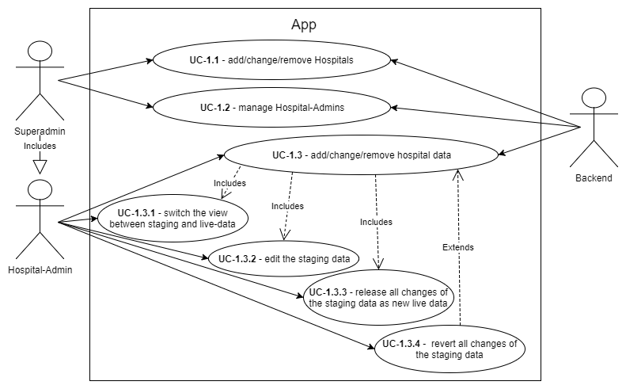
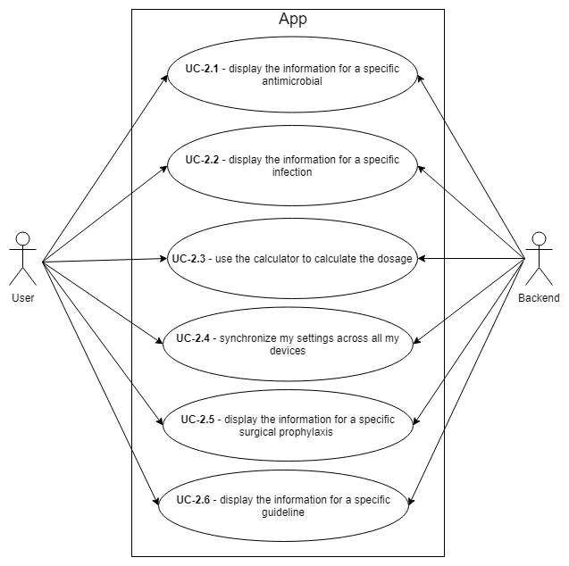

# Requirements
This Document describes the functional and non-functional requirements of the project.

## Functional Requirements
### Use-Cases
The following Use-Cases describe tasks out of the perspective of an user of the App. Users can have the 
following Roles:

#### Roles:
 - **Superadmin:** Has all privileges and can add/remove/change hospitals and manage other admins.
 - **Hospital-Admin:** Can change data for one specific hospital and manage other admins for that hospital.
 - **User:** Has Login-Credentials and can save his settings and data in the cloud.

#### Priorities:
 - **Essential:** Without this Feature the App won't be of any use. **Milestone: v1.0**
 - **Advanced Feature:** Additional Features that are important but can be added later. **Milestone: v1.1**
 - **Nice to have:** If there is time for it, this will be included. **Milestone: > v1.1**

#### Use Case 1: Administrative Functions

Use-Cases for administrative tasks.

| Ref | User Story  | Priority |
|---|---|---|
| **UC-1.1** | *As a* **Superadmin** *I want to be able to* **add/change/remove Hospitals.**| Essential |
| **UC-1.2** | *As a* **Superadmin** *I want to be able to* **manage Hospital-Admins.**| Essential |
| **UC-1.3** | *As a* **Hospital-Admin** *I want to be able to* **add/change/remove hospital data.**| Essential |
| **UC-1.3.1** | *As a* **Hospital-Admin** *I want to be able to* **switch the view between staging and live-data.**| Essential |
| **UC-1.3.2** | *As a* **Hospital-Admin** *I want to be able to* **edit the staging data.**| Essential |
| **UC-1.3.3** | *As a* **Hospital-Admin** *I want to be able to* **release all changes of the staging data as new live data.**| Essential |
| **UC-1.3.4** | *As a* **Hospital-Admin** *I want to be able to* **revert all changes of the staging data.**| Advanced Feature |

#### Use Case 2: User Functions

Use-Cases for everyday tasks.

| Ref | User Story  | Priority |
|---|---|---|
| **UC-2.1** | *As a* **User** *I want to be able to* **display the information for a specific antimicrobial.**| Essential |
| **UC-2.2** | *As a* **User** *I want to be able to* **display the information for a specific infection.**| Essential |
| **UC-2.3** | *As n* **User** *I want to be able to* **use the calculator to calculate the dosage.**| Essential |
| **UC-2.4** | *As a* **User** *I want to be able to* **synchronize my settings across all my devices.**| Advanced Feature |
| **UC-2.5** | *As a* **User** *I want to be able to* **display the information for a specific surgical prophylaxis.**| Nice to Have |
| **UC-2.6** | *As a* **User** *I want to be able to* **display the information for a specific guideline.**| Essential |

## Non-Functional Requirements
- Offline availlability of all Data
- Hosting on PaaS-Platform (-> Google Firebase)
